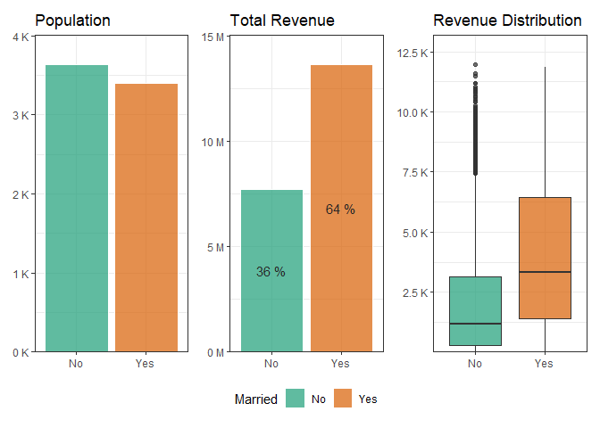
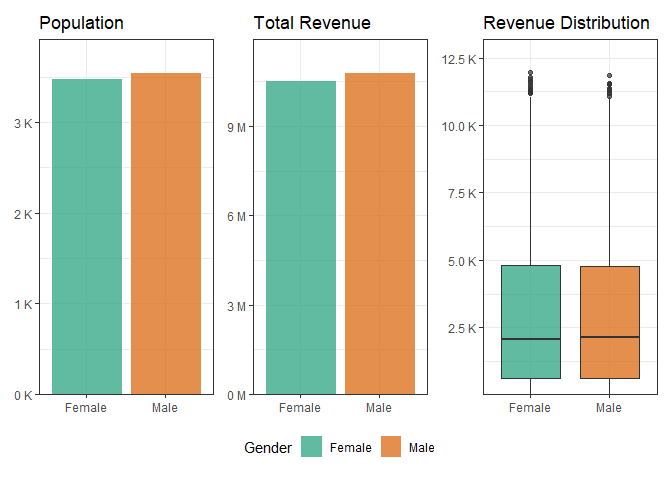
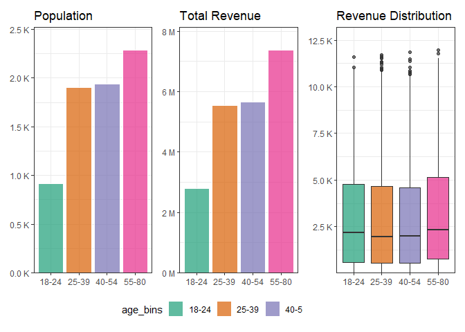
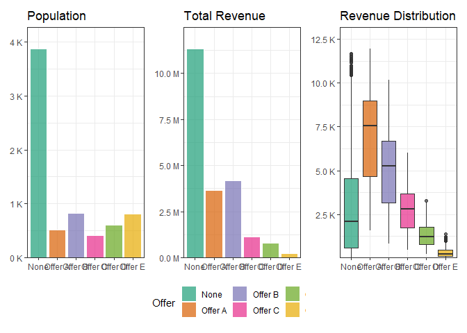
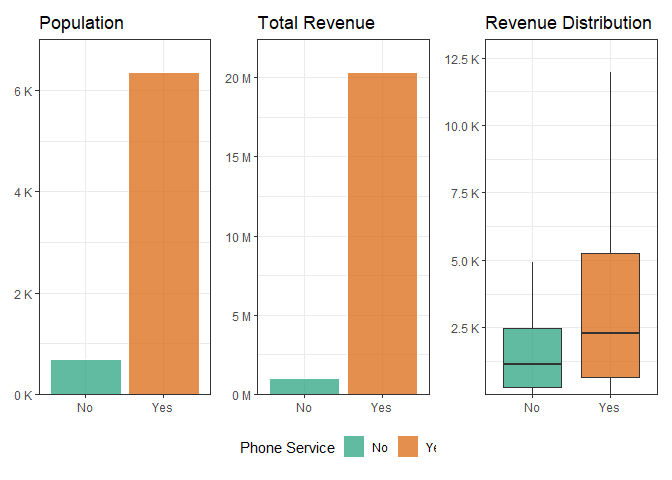

A Tutorial: Customer Churn Data Analysis
================

We are looking at a customer churn data set for a Telecom company and we
will be communicating the insights to the marketing team.

In our exploratory analysis we will be investigating:

1.  What are the main churn reasons?

2.  Who are high value customers?

3.  What are the characteristics of a customer that left, joined, and
    stayed?

``` r
telecom
```

    ## # A tibble: 7,043 × 40
    ##    `Customer ID` Gender   Age Married `Number of Dep…` City  `Zip Code` Latitude
    ##    <chr>         <chr>  <dbl> <chr>              <dbl> <chr>      <dbl>    <dbl>
    ##  1 0002-ORFBO    Female    37 Yes                    0 Fraz…      93225     34.8
    ##  2 0003-MKNFE    Male      46 No                     0 Glen…      91206     34.2
    ##  3 0004-TLHLJ    Male      50 No                     0 Cost…      92627     33.6
    ##  4 0011-IGKFF    Male      78 Yes                    0 Mart…      94553     38.0
    ##  5 0013-EXCHZ    Female    75 Yes                    0 Cama…      93010     34.2
    ##  6 0013-MHZWF    Female    23 No                     3 Midp…      95345     37.6
    ##  7 0013-SMEOE    Female    67 Yes                    0 Lomp…      93437     34.8
    ##  8 0014-BMAQU    Male      52 Yes                    0 Napa       94558     38.5
    ##  9 0015-UOCOJ    Female    68 No                     0 Simi…      93063     34.3
    ## 10 0016-QLJIS    Female    43 Yes                    1 Sher…      95681     39.0
    ## # … with 7,033 more rows, and 32 more variables: Longitude <dbl>,
    ## #   `Number of Referrals` <dbl>, `Tenure in Months` <dbl>, Offer <chr>,
    ## #   `Phone Service` <chr>, `Avg Monthly Long Distance Charges` <dbl>,
    ## #   `Multiple Lines` <chr>, `Internet Service` <chr>, `Internet Type` <chr>,
    ## #   `Avg Monthly GB Download` <dbl>, `Online Security` <chr>,
    ## #   `Online Backup` <chr>, `Device Protection Plan` <chr>,
    ## #   `Premium Tech Support` <chr>, `Streaming TV` <chr>, …

### Churn Categories

Let’s start with exploring the main churn categories column. It seems
like a significant portion of churners are leaving for a competitor. I
think it would be beneficial to see some numbers on the bars, in order
to gain a clearer understanding of this trend.

``` r
library(tidyverse)

telecom %>% 
  filter(`Customer Status` == "Churned") %>% 
  ggplot(aes(fct_rev(fct_infreq(`Churn Category`)))) + geom_bar() + coord_flip() + theme_bw() + 
  theme(axis.title.y = element_blank()) 
```


### 

Much better. It is much easier to see that *almost half of the churners*
opt for a competitor. It’s worth mentioning that the second and third
reasons are head to head, “Dissatisfaction” and “Attitude”.

``` r
telecom %>% 
  filter(`Customer Status` == "Churned") %>%
  count(`Churn Category`) %>%
  mutate(pct = n/sum(n)*100,
         count = n) %>% # For consistency with above plot
  arrange(-pct) %>% 
  mutate(`Churn Category` = reorder(`Churn Category`, pct)) %>% 
  ggplot(aes(x = count , y = `Churn Category`)) +  geom_bar(stat='identity') + 
  geom_text(
    aes(label = paste0(round(pct,0), " %")),
    color = "gray15",
    position = position_stack(vjust = 0.5)) +
    theme(axis.title.y = element_blank()) 
```


### Churn Reasons

Let’s dig deeper into the factors contributing to customer churn.

### 

I want to quickly see the churn reasons along with churn categories.

One thing I notice is “I don’t know” is the 4th reasons for churn. But
does anyone truly part ways with their telecom provider without a clue?
It might be worth pointing this out to the team responsible for the
survey or the stakeholders involved.

Another thing I notice is the potential overlap within some of the churn
reasons. For instance, one churn reason is “service dissatisfaction”
which is under churn category “dissatisfaction”. Unless the customer
completely stopped using telecom services all together, they are highly
likely to have opt our for a competitor.

Similarly, churn reason “lack of affordable download/upload speed” under
churn category “price” and churn reason “competitor offered higher
download speeds” under churn category “competitor”. They opt out for a
competitor, they did not stop using internet. It might be beneficial to
reconsider churn category “competitor” to get clearer distinctions
between different motivations for churning.

``` r
telecom %>% 
  filter(`Customer Status` == "Churned") %>% 
  group_by(`Churn Category`, `Churn Reason`) %>% 
  summarise(n = n()) %>% 
  ungroup() %>% 
  mutate(pct = round(n / sum(n)*100)) %>% 
  arrange(-n)
```

    ## `summarise()` has grouped output by 'Churn Category'. You can override using
    ## the `.groups` argument.

    ## # A tibble: 20 × 4
    ##    `Churn Category` `Churn Reason`                                n   pct
    ##    <chr>            <chr>                                     <int> <dbl>
    ##  1 Competitor       Competitor had better devices               313    17
    ##  2 Competitor       Competitor made better offer                311    17
    ##  3 Attitude         Attitude of support person                  220    12
    ##  4 Other            Don't know                                  130     7
    ##  5 Competitor       Competitor offered more data                117     6
    ##  6 Competitor       Competitor offered higher download speeds   100     5
    ##  7 Attitude         Attitude of service provider                 94     5
    ##  8 Price            Price too high                               78     4
    ##  9 Dissatisfaction  Product dissatisfaction                      77     4
    ## 10 Dissatisfaction  Network reliability                          72     4
    ## 11 Price            Long distance charges                        64     3
    ## 12 Dissatisfaction  Service dissatisfaction                      63     3
    ## 13 Other            Moved                                        46     2
    ## 14 Price            Extra data charges                           39     2
    ## 15 Dissatisfaction  Limited range of services                    37     2
    ## 16 Dissatisfaction  Poor expertise of online support             31     2
    ## 17 Price            Lack of affordable download/upload speed     30     2
    ## 18 Dissatisfaction  Lack of self-service on Website              29     2
    ## 19 Dissatisfaction  Poor expertise of phone support              12     1
    ## 20 Other            Deceased                                      6     0

I wanted to show both categories and reasons in the same graph but I
feel like it overcomplicates things.

``` r
telecom %>% 
  filter(`Customer Status` == "Churned") %>% 
  ggplot(aes(fct_rev(fct_infreq(`Churn Reason`)), fill = `Churn Category`)) + geom_bar() + coord_flip()
```


To show it with percentages

``` r
telecom %>% 
  filter(`Customer Status` == "Churned") %>% 
  group_by(`Churn Category`, `Churn Reason`) %>% 
  summarise(n = n(), .groups = "keep") %>% 
  ungroup() %>% 
  mutate(pct = round(n / sum(n)*100)) %>% 
  arrange(-n) %>% 
  mutate(`Churn Reason` = reorder(`Churn Reason`, n)) %>%  # mutate(n = ordered(n, levels = .$n), n) ~ this wouldn't work
  ggplot(aes(`Churn Reason`, n, fill = `Churn Category`)) + geom_col() + coord_flip() +
  geom_text(
    aes(label = paste0(round(pct,0), " %")),
    color = "gray15",
    position = position_stack(vjust = 0.5))
```


“Competitor having better devices” and “Competitor having better offers”
stand out as two primary reasons for customer churn, followed by
“Attitude of support person”.

``` r
telecom %>% 
  filter(`Customer Status` == "Churned") %>% 
  ggplot(aes(fct_rev(fct_infreq(`Churn Reason`)))) + geom_bar(width = 1, colour = "white") +
  theme(axis.text.x = element_text(angle = 90, hjust=1)) + coord_flip() +
  labs(x = element_blank(),
       y = "Nr",
       title = "Churn Reasons in Depth")
```


### 

I want to focus on the top 10 churn reasons and add percentages in the
bars.

``` r
telecom %>% 
  filter(`Customer Status` == "Churned") %>%
  count(`Churn Reason`) %>%
  mutate(pct = n/sum(n)*100) %>% 
  arrange(-pct) %>% 
  mutate(`Churn Reason` = reorder(`Churn Reason`, pct)) %>% 
  top_n(10) %>%  # Delete this row to see all churn reasons
  ggplot(aes(x = n , y = `Churn Reason`)) +  geom_bar(stat='identity') + 
  theme(axis.text.x = element_text(angle = 90, hjust=1)) +
  geom_text(
    aes(label = paste0(round(pct,0), " %")),
    color = "gray15",
    position = position_stack(vjust = 0.5)) +
  labs(x = element_blank(),
       y = element_blank(),
       title = "Top 10 Churn Reasons")
```

    ## Selecting by pct


Conclusions,

1 - We need to conduct market research to get better devices and better
offers.

2 - We need better support persons either by training existing staff or
hiring new ones.

3 - We could update the exit interview questionnaire applied to
churners.

### Customer Profile

### 

Let’s familiarize ourselves with the data set before identifying the
high value customers.

One of the metrics what makes a customer high value can be total revenue
they bring. Since we will be looking at different customer groups, it is
important to be mindful of the population and mean revenue to gain more
understanding if they are high paying customers or there are many of
them within the company.

Let’s start looking at *Gender* column. Male customers seem to have
brought slightly higher revenue overall.

``` r
telecom %>% 
    group_by(Gender) %>% 
    summarise(n= n(),
              group_total_rev = sum(`Total Revenue`),
              mean_rev = mean(`Total Revenue`)) %>% 
    mutate(pct_rev = group_total_rev/sum(group_total_rev)*100) %>% 
    arrange(-pct_rev)
```

    ## # A tibble: 2 × 5
    ##   Gender     n group_total_rev mean_rev pct_rev
    ##   <chr>  <int>           <dbl>    <dbl>   <dbl>
    ## 1 Male    3555       10818770.    3043.    50.6
    ## 2 Female  3488       10552362.    3025.    49.4

### 

Let’s package the above code as function.

We have to pass the *col_name* parameter as *!!sym(col_name)* as we need
to pass it in quotation marks when we apply the function.

``` r
revenue_breakdown <- function(col_name){
  telecom %>% 
    group_by(!!sym(col_name)) %>% 
    summarise(n= n(),
              group_total_rev = sum(`Total Revenue`),
              mean_rev = mean(`Total Revenue`)) %>% 
    mutate(pct_rev = group_total_rev/sum(group_total_rev)*100) %>% 
    arrange(-pct_rev)
}
```

### 

We can now easily inspect any categorical variable. Upon calling the
function and passing “Married”, we can see that married customers bring
64% of the total revenue within the group, the average revenue they
bring is almost double compared to single customers. This makes sense
since the number of customers the both group is similar.

It could be beneficial for marketing team to target married customers or
spend more of the budget on advertising specific to married customers.

``` r
revenue_breakdown("Married")
```

    ## # A tibble: 2 × 5
    ##   Married     n group_total_rev mean_rev pct_rev
    ##   <chr>   <int>           <dbl>    <dbl>   <dbl>
    ## 1 Yes      3402       13645092.    4011.    63.8
    ## 2 No       3641        7726039.    2122.    36.2

### 

To avoid repeating calling the function over and over again, I am going
to pass the column names using dyplyr. Produces table will be stored in
a list.

``` r
telecom %>%
  colnames() %>%
  .[c(2, 4)] %>% # colnames(telecom[c(2, 4)])
  lapply(revenue_breakdown)
```

    ## [[1]]
    ## # A tibble: 2 × 5
    ##   Gender     n group_total_rev mean_rev pct_rev
    ##   <chr>  <int>           <dbl>    <dbl>   <dbl>
    ## 1 Male    3555       10818770.    3043.    50.6
    ## 2 Female  3488       10552362.    3025.    49.4
    ## 
    ## [[2]]
    ## # A tibble: 2 × 5
    ##   Married     n group_total_rev mean_rev pct_rev
    ##   <chr>   <int>           <dbl>    <dbl>   <dbl>
    ## 1 Yes      3402       13645092.    4011.    63.8
    ## 2 No       3641        7726039.    2122.    36.2

### 

For each corresponding category, I want to have 3 side-by-side charts
using patchwork package showing:

1.  Population
2.  Total Revenue
3.  Revenue Distribution

``` r
p1 <- telecom %>% 
  ggplot(aes(Married, fill = Married)) + geom_bar(alpha = 0.7) + 
  scale_y_continuous(labels = label_number(suffix = " K", scale = 1e-3), expand = expansion(mult = c(0,0.1))) +
  theme_bw() + 
  theme(axis.title.x = element_blank(), axis.title.y = element_blank(), legend.position = "none") + 
  ggtitle("Population") +
  scale_fill_brewer(palette = "Dark2")
  
p2 <- revenue_breakdown("Married") %>% 
  ggplot(aes(Married, group_total_rev, fill = Married)) + geom_col(alpha = 0.7) + 
  geom_text(
    aes(label = paste0(round(pct_rev, 0), " %")),
    color = "gray15",
    position = position_stack(vjust = 0.5)) +
  scale_y_continuous(labels = label_number(suffix = " M", scale = 1e-6), expand = expansion(mult = c(0,0.1))) +
  theme_bw() + 
  theme(axis.title.x = element_blank(), axis.title.y = element_blank()) + 
  ggtitle("Total Revenue") +
  scale_fill_brewer(palette = "Dark2")


p3 <- telecom %>% 
  ggplot(aes(Married, `Total Revenue`, fill = Married)) + geom_boxplot(alpha = 0.7) + 
  scale_y_continuous(labels = label_number(suffix = " K", scale = 1e-3), expand = expansion(mult = c(0,0.1))) +
  theme_bw() + 
  theme(axis.title.x = element_blank(), axis.title.y = element_blank(), legend.position = "none") + 
  ggtitle("Revenue Distribution") +
  scale_fill_brewer(palette = "Dark2") 

p1 + (p2 + plot_layout(guides = "collect") & theme(legend.position = 'bottom')) + p3
```

<!-- -->

``` r
options(scipen=10000)
```

### 

Let’s package the above code as function:

``` r
revenue_breakdown_viz <- function(col_name){
  
  telecom_summary <- telecom %>% 
    group_by(!!sym(col_name)) %>% 
    summarise(n = n(),
              group_total_rev = sum(`Total Revenue`),
              mean_rev = mean(`Total Revenue`)) %>% 
    mutate(pct = group_total_rev/sum(group_total_rev)*100) %>% 
    arrange(-pct)
  
  
  p1 <- telecom %>% 
    ggplot(aes(!!sym(col_name), fill = !!sym(col_name))) + geom_bar(alpha = 0.7) + 
    scale_y_continuous(labels = label_number(suffix = " K", scale = 1e-3), expand = expansion(mult = c(0,0.1))) +
    theme_bw() + 
    theme(axis.title.x = element_blank(), axis.title.y = element_blank(), legend.position = "none") + 
    ggtitle("Population") +
    scale_fill_brewer(palette = "Dark2")
  
  p2 <- telecom_summary %>% 
    ggplot(aes(!!sym(col_name), group_total_rev, fill = !!sym(col_name))) + geom_col(alpha = 0.7)+ 
    scale_y_continuous(labels = label_number(suffix = " M", scale = 1e-6), expand = expansion(mult = c(0,0.1))) +
    theme_bw() + 
    theme(axis.title.x = element_blank(), axis.title.y = element_blank()) + 
    ggtitle("Total Revenue") +
    scale_fill_brewer(palette = "Dark2")
  
  
  p3 <- telecom %>% 
    ggplot(aes(!!sym(col_name), `Total Revenue`, fill = !!sym(col_name))) + geom_boxplot(alpha = 0.7) + 
    scale_y_continuous(labels = label_number(suffix = " K", scale = 1e-3), expand = expansion(mult = c(0,0.1))) +
    theme_bw() + 
    theme(axis.title.x = element_blank(), axis.title.y = element_blank(), legend.position = "none") + 
    ggtitle("Revenue Distribution") +
    scale_fill_brewer(palette = "Dark2") 
  
  p1 + (p2 + plot_layout(guides = "collect") & theme(legend.position = 'bottom')) + p3
  
  
}
```

### 

Let’s see if it worked

``` r
revenue_breakdown_viz("Married")
```

<!-- -->

### Now I want to use my package for multiple columns

``` r
# str(telecom)


list_viz1 <- telecom %>% 
  colnames() %>% 
  .[c(2, 39, 4, 40)] %>% # 10 is Nr of referrals
  lapply(revenue_breakdown_viz)

list_viz1
```

    ## [[1]]

<!-- -->

    ## 
    ## [[2]]

<!-- -->

    ## 
    ## [[3]]

<!-- -->

    ## 
    ## [[4]]

<!-- -->

# Other

``` r
# str(telecom)


list_viz2 <- telecom %>% 
  colnames() %>% 
  .[c(12, 13)] %>% # 12 is Offer, 29 is payment method add 15:29
  lapply(revenue_breakdown_viz)

list_viz2
```

    ## [[1]]

<!-- -->

    ## 
    ## [[2]]

<!-- -->

# Main takeaways:

1.  No significant difference between genders.

2.  Age 55+ customers are the biggest category, and with the highest
    median spend, too. Followed by age 18-24 as highest spend but they
    are the lowest in population.

3.  Married customers brought more revenue on average for this quarter
    despite having slightly less population in the mix.

4.  
